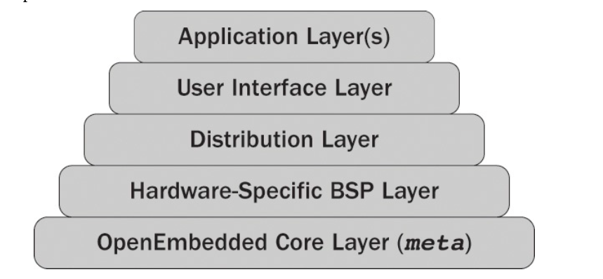

 #Repository for all facts and info about yocto and OE.
 
## Build enviroment
**source oe-init-build-env <buildenv> <port>** - launches BitBake server, which is listening TCP port for command. Default args: <buildenv> - *build*, <port> - *12345* 

## Metadata structure 
 

